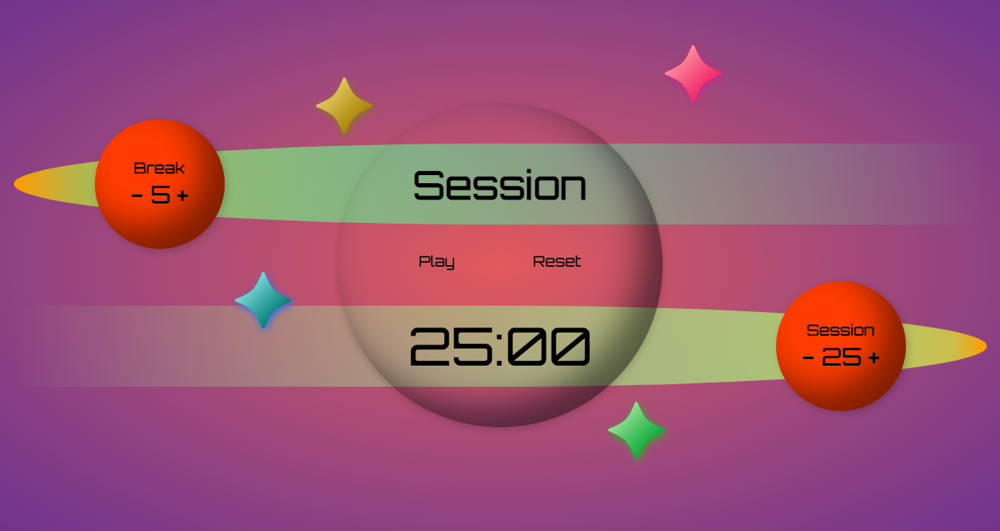

# Space-o-doro

&nbsp;

&nbsp;

---

&nbsp;

&nbsp;&nbsp;

## Summary

Space-o-doro is a fun space-themed pomodoro timer, built with React and CSS mostly. If you love space and productivity then you will love this project!

---

## Usage

If you want to use this fun tool check it out [here](ian-flynn.github.io/space-o-doro/)!
If you would like to incorporate this code into your own projects or website, you have my full support!

---

### License | MIT

